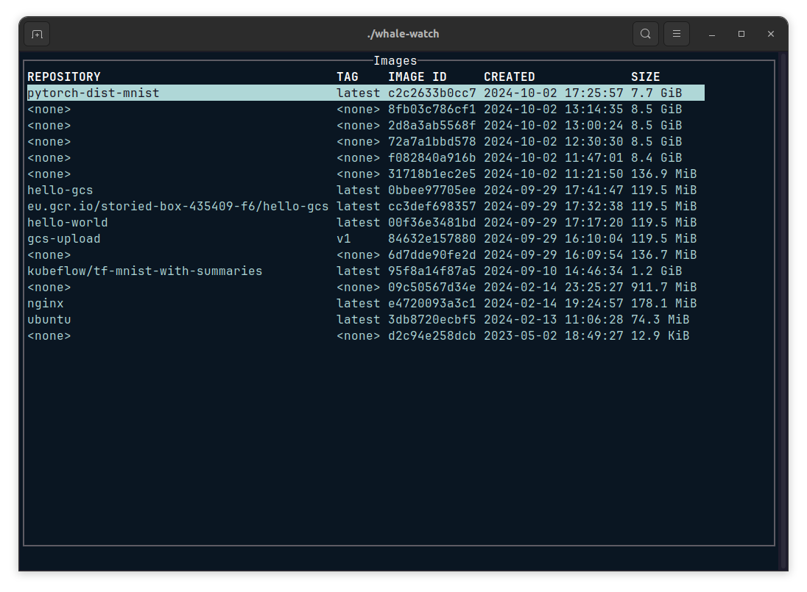
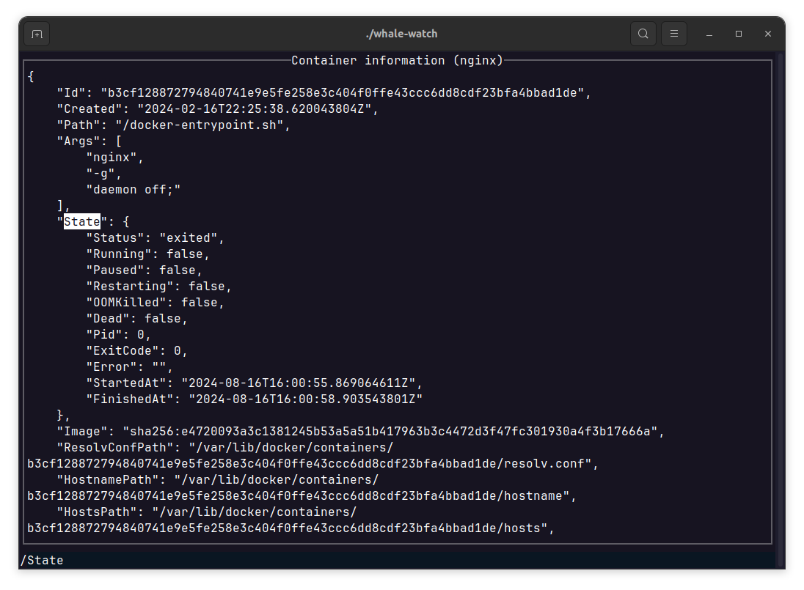
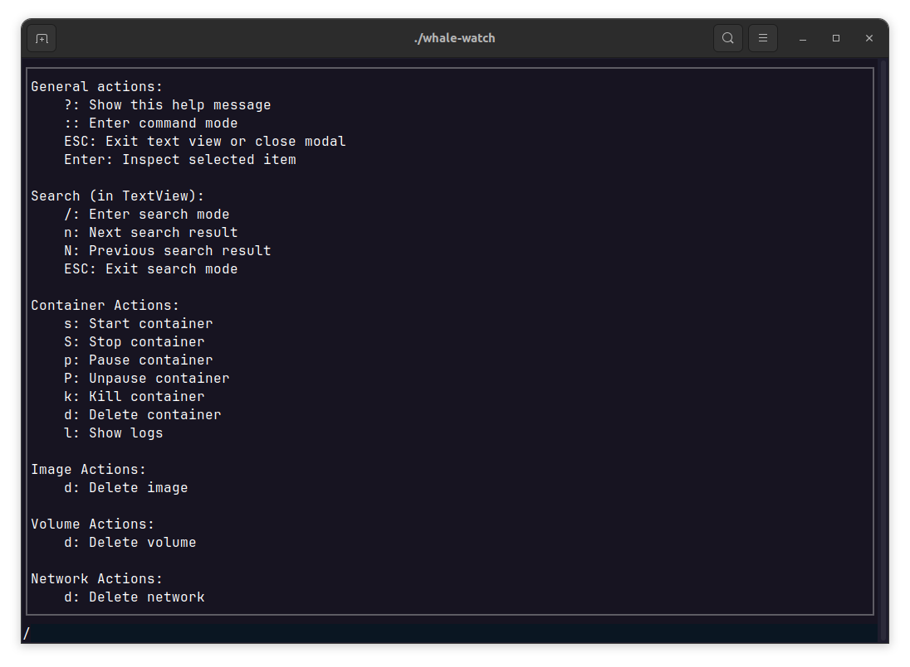

# whale-watch

CLI tool to manage Docker resources. This project is inspired by [K9s](https://github.com/derailed/k9s). whale-watch implements most of the features from the Docker CLI and presents them in a K9s style UI.

## Key bindings

Vim keybindings is used for navigation and interaction.

| Action                        | Keybinding |
|-------------------------------|-----------|
| Show help menu                | ?         |
| Enter command mode            | :         |
| Inspect container or image    | Enter     |
| Exit text view or close modal | ESC       |

## Screenshots

_List images_



_Inspect container_



_Show help menu_



## Build from source

whale-watch currently uses Go 1.22.0 to build the project. Clone the repo and build the binary using:

```
go build -o whale-watch ./cmd/main.go
```